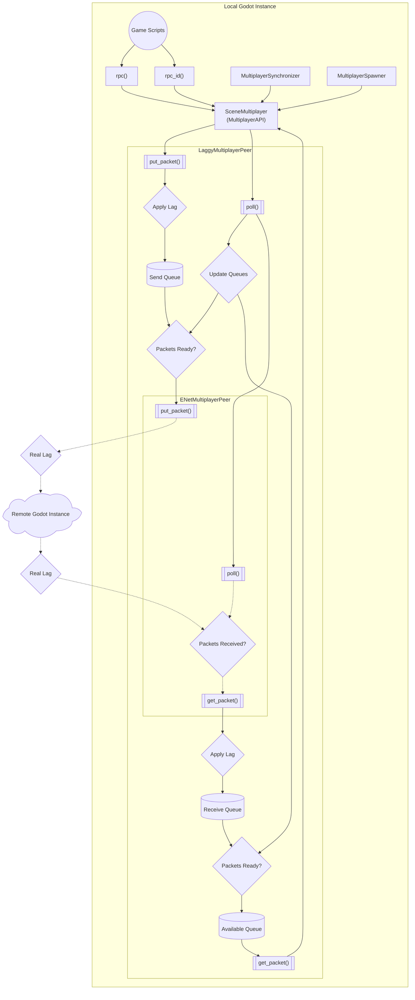

```mermaid
flowchart TD
subgraph local[Local Godot Instance]
    scripts((Game Scripts))
    scripts --> rpc["rpc()"] --> multiplayer
    scripts --> rpc_id["rpc_id()"] --> multiplayer
    multiplayer["SceneMultiplayer<br>(MultiplayerAPI)"]
    MultiplayerSynchronizer --> multiplayer
    MultiplayerSpawner --> multiplayer
    multiplayer --> put_packet
    get_packet --> multiplayer
    multiplayer --> poll
    subgraph LaggyMultiplayerPeer
        subgraph ENetMultiplayerPeer
            enet_put_packet[["put_packet()"]]
            enet_get_packet[["get_packet()"]]
            enet_received{Packets Received?} .-> enet_get_packet
            enet_poll[["poll()"]] .-> enet_received
        end
        put_packet[["put_packet()"]]
        get_packet[["get_packet()"]]
        poll[["poll()"]] --> update{Update Queues}
        poll --> enet_poll
        ready1{Packets Ready?}
        ready2{Packets Ready?}
        send_queue[(Send Queue)]
        receive_queue[(Receive Queue)]
        available_queue[(Available Queue)]
        update --> ready1 --> enet_put_packet
        update --> ready2
        put_packet --> delay1{Apply Lag} --> send_queue
        enet_get_packet --> delay2{Apply Lag} --> receive_queue
        send_queue --> ready1
        receive_queue --> ready2 --> available_queue --> get_packet
    end
end
remote@{ shape: cloud, label: Remote Godot Instance }
enet_put_packet .-> delay3{Real Lag} .-> remote
remote .-> delay4{Real Lag} .-> enet_received
```