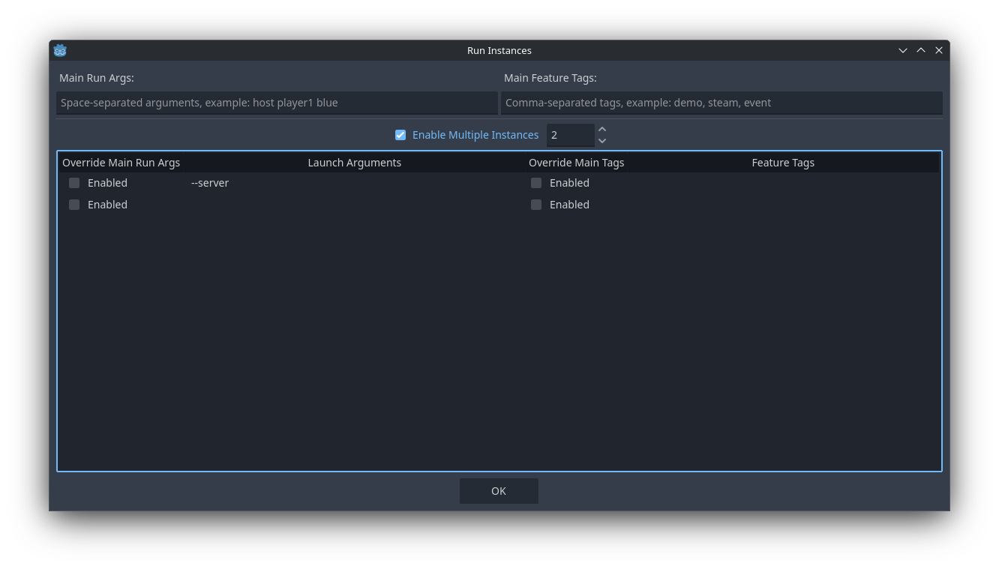

# LaggyMultiplayerPeer
Network lag simulation for the Godot Multiplayer API.

## Features
- Simulates both latency and packet loss, while respecting ordering and reliability requirements.
- Works with any underlying `MultiplayerPeer` type. ENet, WebRTC, WebSocket, and third party ones like Steam, EOS, etc.
- Does not use a custom protocol, so a `LaggyMultiplayerPeer` can still communicate with non-wrapped peers over the network.
- Complete documentation available in-engine: press <kbd>F1</kbd> and search for "LaggyMultiplayerPeer".
- Packaged as a GDExtension, which can be added into a project as an addon.
- Easy to use with a few lines of GDScript, example from the documentation:

```gdscript
var enet_peer := ENetMultiplayerPeer.new()
var err := enet_peer.create_client("localhost", 1234) # Or your own connection details
if err != OK:
	push_error("Failed to create client, error: %s" % error_string(err))
	return
# 200ms delay with 1% packet loss
multiplayer.multiplayer_peer = LaggyMultiplayerPeer.create(enet_peer, 0.2, 0.2, 0.01)
```

## Requirements
- Godot 4.4 or higher.
  - Older versions may work, but are untested.

## Limitations
- No C# bindings; Blocked by https://github.com/godotengine/godot-proposals/issues/8191.
  - Can still be instantiated with ClassDB, and used through the GodotObject Get/Set/Call methods.
- The addon has only been tested on Linux. Other platforms need testing.

## Installation
- Grab the artifact zip file from GitHub action run in the `main` branch, and extract the `addons/` folder from the zip to the root of your project.

## Development
- Make sure the repository has been cloned using `git clone --recursive`. If it hasn't, initialize and sync submodules by running `git submodule init` and `git submodule update --recursive`.
- Ensure you have the required tools set up to compile Godot, like `scons`, a C++ compiler, and any other platform-specific requirements. See the [official documentation](https://docs.godotengine.org/en/stable/engine_details/development/compiling/introduction_to_the_buildsystem.html) for details.
- Run `scons` in the root of the project directory, optionally passing extra parameters to build for a specific platform, or with specific settings (ie. `dev_build=yes` for debugging symbols).
- The compiled library files will be installed in `demo/bin/${platform}/`.
- Optionally, run the demo project to confirm that your changes are working.

## Demo Project
A runnable demo project is included in the `demo/` sub-folder.

Before running it, please compile the extension using the development instructions. Alternatively, the demo is also included with pre-built libraries in the addon.

Also, to make use of multiplayer features present in the demo, you will have to enable multiple instances in the editor, with the following configuration:



Controls:
- Left Mouse Button: Move local player to position (unreliable sync).
- Right Mouse Button: "Ping" a location to all peers (reliable sync).
- Spacebar: Send a continuous stream of sequential numbers to other peers (reliable rpc).
- Bottom sliders (client-only): Adjust the latency and packet loss for this client in real-time.

## Design
An architecture overview can be seen in [ARCHITECTURE.md](ARCHITECTURE.md).

## License
This project is distributed under the MIT License. See [LICENSE.md](LICENSE.md) for details.

Additionally, [`src/variant_utils.h`](src/variant_utils.h) and [`src/variant_utils.cpp`](src/variant_utils.cpp) contain partial reproductions of source code from the Godot project, which is also distributed under the MIT License. Copyright details are reproduced in these files.
